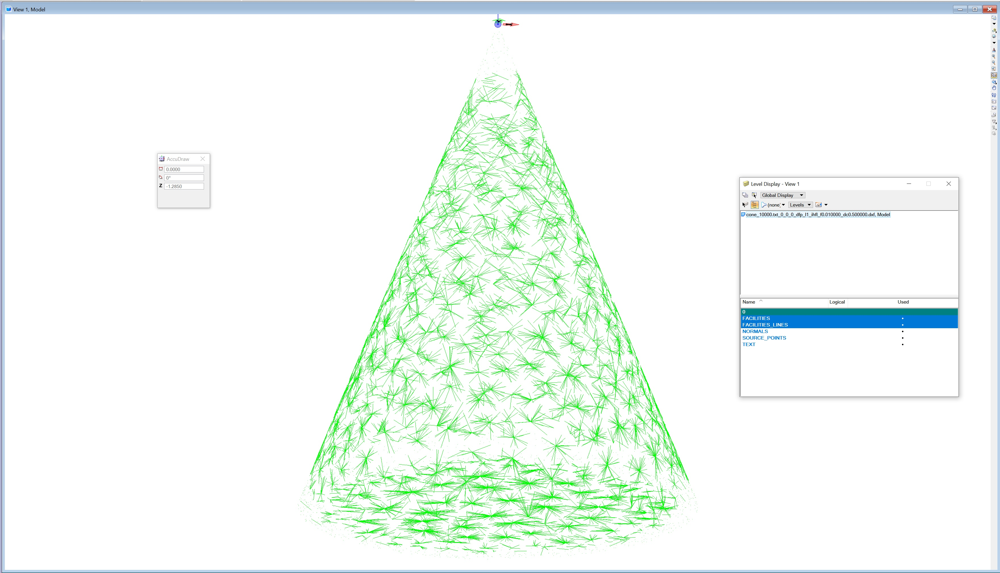
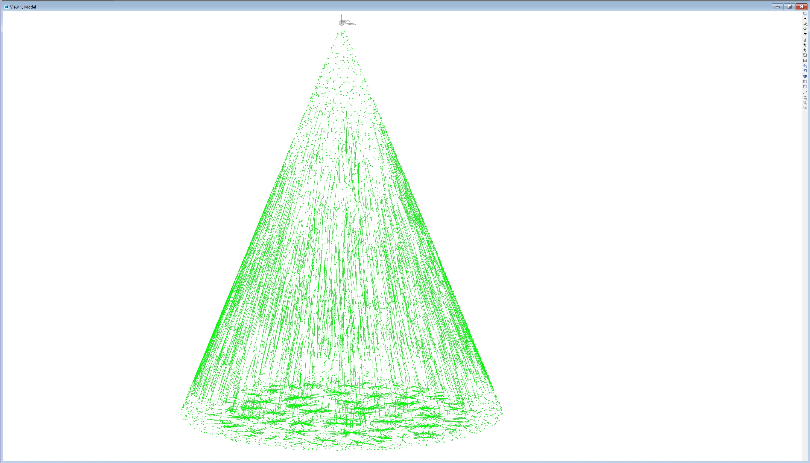
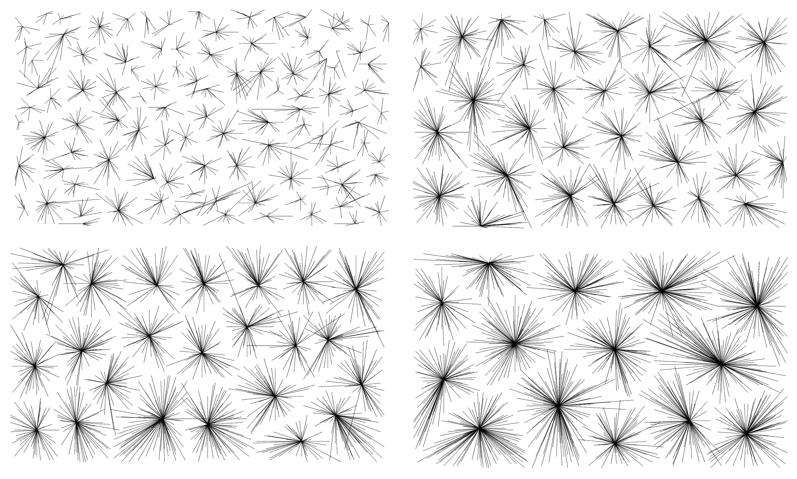
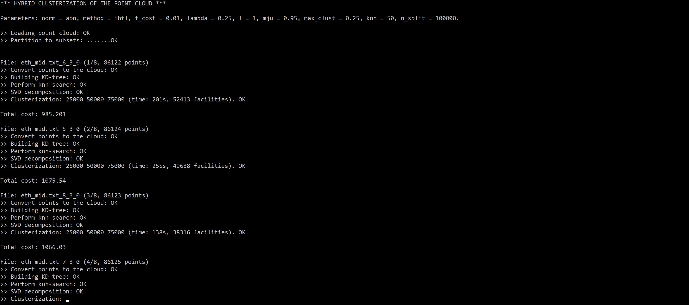
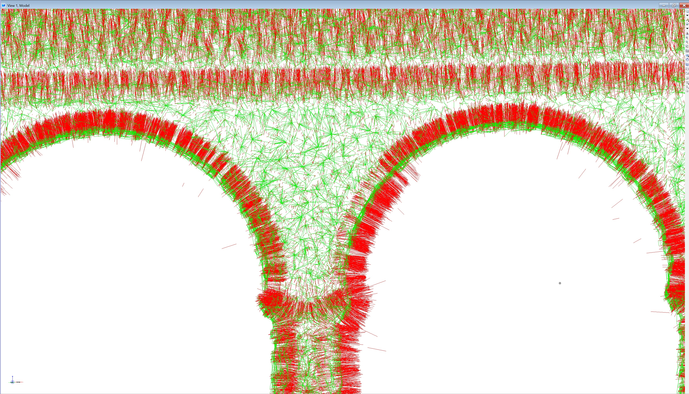
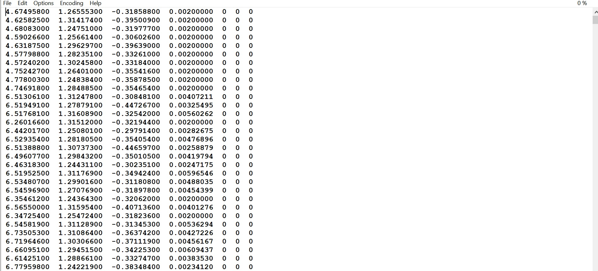
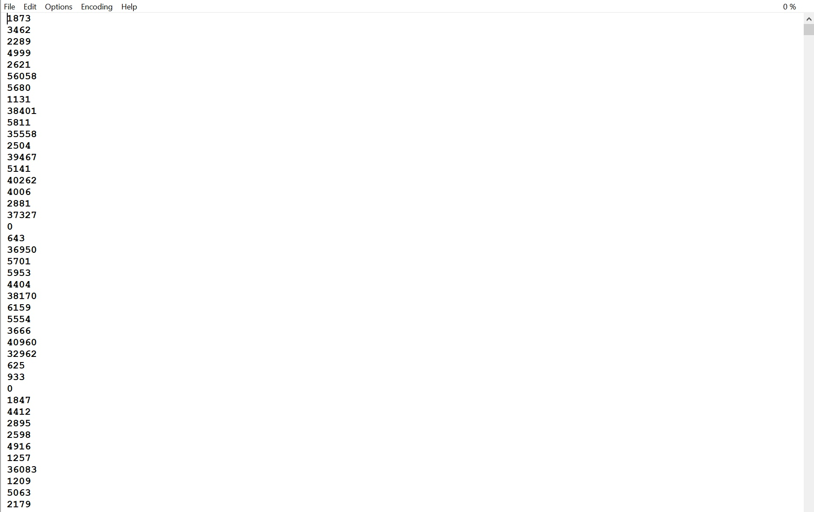

# 1. IHFL, short tutorial

Basic properties and features of the facility location clustering of the point cloud, according to the hybrid 
constrained pseudonorm with an additional penalty, are described.

## 1.1. Source code
The source code of the clusterization software written in C++ (C++ 2021) is bundled as the Visual Studio 2022 project. 
It depends on the following libraries:

- nanoflann, https://github.com/jlblancoc/nanoflann,
- Eigen, https://gitlab.com/libeigen/eigen, 
- C++ Bost, https://www.boost.org/.

## 1.2. Running the software

The binary version (64 bit, VS 2022 compiler) of the clusterization software

     ihfl.exe

can be found in \bin directory. To run the software, open the command prompt and use the following combination of parameters, values, and options: 

	ihfl file_name +parameter1=value1 +parameter2=value2 -option1 -option2

## 1.3 Input file

The input txt file contains the Cartesian coordinates X, Y, Z of the input point cloud. Each item is separated by space or TAB:

	0.3912   -0.3071   -1.2434  
	0.1010   0.4371   -1.1216   
	0.3449   0.3412   -1.2500   
	-0.2498   0.2537   -0.8900  
	0.4012   0.0912   -1.0287   
	0.2398   -0.1096   -0.6590  
	0.4011   0.1324   -1.0559   

and may also contain the facility cost:

	0.3912   -0.3071   -1.2434  0.15
	0.1010   0.4371   -1.1216   0.25
	0.3449   0.3412   -1.2500   0.07
	-0.2498   0.2537   -0.8900  0.12
	0.4012   0.0912   -1.0287   0.45
	0.2398   -0.1096   -0.6590  0.97
	0.4011   0.1324   -1.0559   0.33

Additionally, the RGB components stored as integers:

	26.0135 59.13663864 295.3752 80 92 103
	25.7128 58.88088226 295.5329 56 66 78
	25.9133 59.05138397 295.4500 88 91 105
	25.6027 58.86519623 295.5272 56 67 79
	25.7029 58.95045090 295.4754 55 69 82
	25.5829 59.00433350 295.3419 82 92 104
	25.5829 59.00433350 295.3919 82 88 100 

can be combined with the facility costs:

	26.0135 59.13663864 295.3752 0.15 80 92 103
	25.7128 58.88088226 295.5329 0.25 56 66 78
	25.9133 59.05138397 295.4500 0.07 88 91 105
	25.6027 58.86519623 295.5272 0.12 56 67 79
	25.7029 58.95045090 295.4754 0.45 55 69 82
	25.5829 59.00433350 295.3419 0.97 82 92 104
	25.5829 59.00433350 295.3919 0.33 82 88 100 

## 1.4 List of parameters

### 1.4.1 Setting the pseudonorm

The desired (pseudo) norm can be set using the parameter "norm"

	+norm=val

where:

- abn: tangent model, pseudonorm G1,
- dis: tangent model, pseudonorm G2,
- ablp: secant model, pseudonorm G3,
- dfp: secant model, pseudonorm G4,
- l2: L2 norm.
	
#### Example:
*Clusterization according to the DFP pseudonorm*

	ihfl "test.txt" +norm=dfp

#### Example:
*Clusterization according to the ABN pseudonorm*

	ihfl "test.txt" +norm=abn

	
### 1.4.2 Setting the facility cost

User-defined facility cost can be set using the parameter "fc"

	+fc=val

It overrides the values of facility costs loaded from the input file. 

Note: In our paper, fc refers to the maximum surface complexity (a maximum acceptable notch or protrusion), if the switch -n is enabled. The typical value for point clouds acquired by ALS is 0.01 - 0.05 m.

#### Example:
*Clusterization according to dfp pseudonorm using IHFL algorithm with the maximum surface complexity of 2 cm*

	ihfl "test.txt" +norm=dfp +fc=0.02

### 1.4.3 Setting the maximum ball radius

User-defined maximum value of the ball radius lambda can be set using the parameter "lambda"

	+lambda=value

In general, it represents the maximum cluster radius. The typical value for dense point clouds acquired by ALS is 0.2 - 0.7 m.

#### Example:
*Clusterization according to dfp pseudonorm using IHFL algorithm with the maximum surface complexity of 2 cm
and maximum ball radius of 50 cm*

	ihfl "test.txt" +norm=dfp +fc=0.02 +lambda=0.5

### 1.4.4 Setting the subset size

The input datasets can recursively be partitioned into subsets using kD-tree. The maximum amount points per a subset can be set
using the parameter "ns"

	+ns=value

The typical size of the subset used for point clouds acquired by ALS is 100000.

All subsets of the input point cloud are stored into separate files. Their list can be found in *.list file:

	test.txt.list:
	   test.txt_6_3_0
	   test.txt_5_3_0
	   test.txt_8_3_0
	   test.txt_7_3_0
	   test.txt_12_3_0
	   test.txt_11_3_0
	   test.txt_14_3_0
	   test.txt_13_3_0

If the *.list file is found in the same folder, the splitting procedure is skipped.
 

#### Example:
*Clusterization according to dfp pseudonorm using IHFL algorithm with the maximum surface complexity of 2 cm
and maximum ball radius of 50 cm. The point cloud is partitioned into subsets with the maximum size of 100 000 points*

	ihfl "test.txt" +norm=dfp +fc=0.02 +lambda=0.5 +ns=100000

### 1.4.5 Normal vector estimation

User-defined value of the k-nearest neighbors used for the normal vector estimation using PCA. It can be set using the parameter "knn"

	+knn=value

The typical amount of k-nearest neighbors for point clouds acquired by ALS is 50.

#### Example:
*Clusterization according to dfp pseudonorm using IHFL algorithm with the maximum surface complexity of 2 cm
and maximum ball radius of 50 cm. The point cloud is partitioned into subsets with the maximum size of 100 000 points, the normal
vector is estimated from 30 k-nearest neighbors*

	ihfl "test.txt" +norm=dfp +fc=0.02 +lambda=0.5 +ns=100000 +knn=30

### 1.4.6 Setting the isotropic ratio

User-defined isotropic factor mju, mju in (0,1), regulating the influence of the L2 metric and pseudometric.  

	+mju=value

Important parameter of the clusterization significantly affecting the behavior of the clusterization process: 
- mju=0 -> L2 metric (fully isotropic), 
- mju=1 ->pseudometric (fully anisotropic).

The typical value of the isotropic factor is mju=0.95.

#### Example:
*Clusterization according to dfp pseudonorm using IHFL algorithm with the maximum surface complexity of 2 cm
and maximum ball radius of 50 cm. The point cloud is partitioned into subsets with a maximum size of 100 000 points, the normal
vector is estimated from 30 k-nearest neighbors, and the isotropic factor is set to 0.95*

	ihfl "test.txt" +norm=dfp +fc=0.02 +lambda=0.5 +ns=100000 +knn=30 +mju=0.95

## 1.5 List of switches

### 1.5.1 Recompute values of facility costs

The costs of input points can be recomputed according to the behavior of normal vectors using the switch

	-n 	

Otherwise, the loaded or default facility costs (fc=1) are used.

#### Example:
*Clusterization according to dfp pseudonorm using IHFL algorithm with the maximum surface complexity of 2 cm
and maximum ball radius of 50 cm. The point cloud is partitioned into subsets with a maximum size of 100 000 points, the normal
vector is estimated from 30 k-nearest neighbors, the isotropic factor is set to 0.95*

	ihfl test.txt +norm=dfp +fc=0.02 +lambda=0.5 +ns=100000 +knn=30 +mju=0.95 -n

### 1.5.2 Exporting clusters to DXF

The resulted point cloud, facilities, connected clients and normal vectors can be exported into DXF file using the switch

	-e

#### Example:
*Clusterization according to dfp pseudonorm using IHFL algorithm with the maximum surface complexity of 2 cm
and maximum ball radius of 50 cm. The point cloud is partitioned into subsets with the maximum size of 100 000 points, the normal
vector is estimated from 30 k-nearest neighbors, the isotropic factor is set to 0.95, and the resulted clusters are exported into DXF file*

	ihfl test.txt +norm=dfp +met=ihfl +fc=0.02 +lam=0.5 +ns=100000 +knn=30 +mju=0.95 -n -e

This option reduces the performance of clustering! 

## 1.6 Results of the clusterization

The results of the clusterization process are stored in two *.txt files:
 - *facil.txt,
 - *facil2.txt.

For any subset of the point cloud, these files are generated automatically.

#### File: *facil.txt
List of all facilities and their costs that can easily be imported into external SW tool (e.g., the Cloud Compare).

#### File: *facil2.txt

Any point of the input point cloud stores ID of its facility (to which it is connected).

#### Important note:
All generated files *facil*.txt in the folder need to be deleted by the user before running the clusterization software. Otherwise, the clusterization will not be performed.