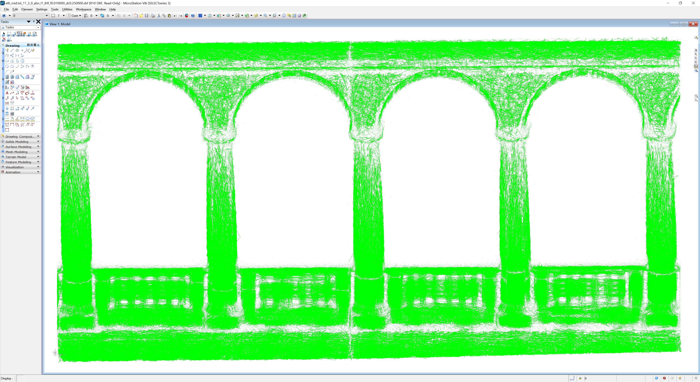

1. IHFL, short manual

Facility location clustering of the point cloud according to the hybrid constrained pseudonorm with additional penalty. 

1.1. Running the software

Open the command prompt and use the following combination of parameters, their value and options: 

	ihfl file_name +parameter1=value1 +parameter2=value2 -option1 -option2

1.2 Input file

The input txt file contains the Cartesian coordinates X, Y, Z of points of the input point cloud. Each item is separated by space or TAB:

	0.3912   -0.3071   -1.2434  
	0.1010   0.4371   -1.1216   
	0.3449   0.3412   -1.2500   
	-0.2498   0.2537   -0.8900  
	0.4012   0.0912   -1.0287   
	0.2398   -0.1096   -0.6590  
	0.4011   0.1324   -1.0559   

The facility costs can also be stored:

	0.3912   -0.3071   -1.2434  0.15
	0.1010   0.4371   -1.1216   0.25
	0.3449   0.3412   -1.2500   0.07
	-0.2498   0.2537   -0.8900  0.12
	0.4012   0.0912   -1.0287   0.45
	0.2398   -0.1096   -0.6590  0.97
	0.4011   0.1324   -1.0559   0.33

Or, additionally, the RGB components:

	26.0135 59.13663864 295.3752 80 92 103
	25.7128 58.88088226 295.5329 56 66 78
	25.9133 59.05138397 295.4500 88 91 105
	25.6027 58.86519623 295.5272 56 67 79
	25.7029 58.95045090 295.4754 55 69 82
	25.5829 59.00433350 295.3419 82 92 104
	25.5829 59.00433350 295.3919 82 88 100 

can be combined with the facility costs:

	26.0135 59.13663864 295.3752 0.15 80 92 103
	25.7128 58.88088226 295.5329 0.25 56 66 78
	25.9133 59.05138397 295.4500 0.07 88 91 105
	25.6027 58.86519623 295.5272 0.12 56 67 79
	25.7029 58.95045090 295.4754 0.45 55 69 82
	25.5829 59.00433350 295.3419 0.97 82 92 104
	25.5829 59.00433350 295.3919 0.33 82 88 100 

1.3 List of parameters

1.3.1 Setting the pseudonorm

The pseudonorm can be set using the parameter "norm"

+norm=val

	abn: tangent model, pseudonorm G1
	dis: tangent model, pseudonorm G2
	ablp: secant model, pseudonorm G3
	dfp: secant model, pseudonorm G4
	l2: L2 norm
	
Example: Clusterization according to the DFP pseudonorm

	ihfl "test.txt" +norm=dfp

Example: Clusterization according to the ABN pseudonorm

	ihfl "test.txt" +norm=abn

	
1.3.2 Setting the pseudonorm threshold

User-defined pseudonorm threshold refering to the maximum surface complexity (a maximum acceptable notch or protrusion) 
can be set using the parameter "f"

	+fc=val

Typical value used for point clouds acquired by ALS is 1-5cm.

Example: Clusterization according to dfp pseudonorm using IHFL algorithm with the maximum surface complexity of 2 cm

	ihfl "test.txt" +norm=dfp +fc=0.02

1.3.3 Setting the maximum ball radius

User-defined maximum value of the ball radius lambda can be set using the parameter "ball". This value represents the maximum
radius of the cluster.

	+lambda=value

Typical value used for point clouds acquired by ALS is 20-70 cm.

Example: Clusterization according to dfp pseudonorm using IHFL algorithm with the maximum surface complexity of 2 cm
and maximum ball radius of 50 cm

	ihfl "test.txt" +norm=dfp +fc=0.02 +lambda=0.5

1.3.4 Setting the subset size

The input datasets can be recursively partitioned into subsets using kD-tree. The maximum amount points per a subset can be set
using the parameter "ns"

	+ns=value

Typical size of the subset used for point clouds acquired by ALS is 100000.

Example: Clusterization according to dfp pseudonorm using IHFL algorithm with the maximum surface complexity of 2 cm
and maximum ball radius of 50 cm. The point cloud is partitioned into subsets with the maximum size of 100 000 points.

	ihfl "test.txt" +norm=dfp +fc=0.02 +lambda=0.5 +ns=100000

1.3.5 Setting the subset size

User-defined value of the k-nearest neighbors used for the estimation of the normal using PCA can be set using the parameter "knn"

	+knn=value

Typical amount of k-nearest neighbors for point clouds acquired by ALS is 30.

Example: Clusterization according to dfp pseudonorm using IHFL algorithm with the maximum surface complexity of 2 cm
and maximum ball radius of 50 cm. The point cloud is partitioned into subsets with the maximum size of 100 000 points, the normal
vector is estimated from 30 k-nearest neighbors.

	ihfl "test.txt" +norm=dfp +fc=0.02 +lambda=0.5 +ns=100000 +knn=30

1.3.6 Setting the isotropic ratio

User defined isotropic factor mju, mju in (0,1), regulating the influence of the L2 metric and pseudometric.  Important parameter of 
the clusterization, significantly affects the behavior of the clusterization process: mju=0 -> L2 metric (fully isotropic), 
mju=1 ->pseudometric (fully anisotropic)

	+mju=value

Typical value of the isotropic factor is mju=0.95.

Example: Clusterization according to dfp pseudonorm using IHFL algorithm with the maximum surface complexity of 2 cm
and maximum ball radius of 50 cm. The point cloud is partitioned into subsets with the maximum size of 100 000 points, the normal
vector is estimated from 30 k-nearest neighbors, the isotropic factor is set to 0.95.

	ihfl "test.txt" +norm=dfp +fc=0.02 +lambda=0.5 +ns=100000 +knn=30 +mju=0.95

1.4 List of switches

1.4.1 Recompute values of facility costs

The costs of input points can be recomputed according to the ehavior of normal vectors using the switch "n"

	-n 	

Otherwise, the loaded or default costs are used.

Example: Clusterization according to dfp pseudonorm using IHFL algorithm with the maximum surface complexity of 2 cm
and maximum ball radius of 50 cm. The point cloud is partitioned into subsets with the maximum size of 100 000 points, the normal
vector is estimated from 30 k-nearest neighbors, the isotropic factor is set to 0.95.

	ihfl test.txt +norm=dfp +fc=0.02 +lambda=0.5 +ns=100000 +knn=30 +mju=0.95 -n

1.4.2 Exporting clusters to DXF

The resulted facilities and connected clients can be exported into DXF file using the switch "e".

	-e

Example: non-uniform clusterization according to dfp pseudonorm using IHFL algorithm with the maximum surface complexity of 2 cm
and maximum ball radius of 50 cm. The point cloud is partitioned into subsets with the maximum size of 100 000 points, the normal
vector is estimated from 30 k-nearest neighbors, the isotropic factor is set to 0.95, the resulted clusters are exported into DXF file.

	ihfl test.txt +norm=dfp +met=ihfl +fc=0.02 +lam=0.5 +ns=100000 +knn=30 +mju=0.95 -n -e

This option reduces the performance of clustering! 

1.5 Results of the clusterization

The output facilities are stored into *.txt files. 

File: *facil.txt

List of all facilities,  they can easily be imported into external SW tool, for example the Cloud Compare.

File: *facil2.txt

Any point of the input cloud stores ID of its facility.

